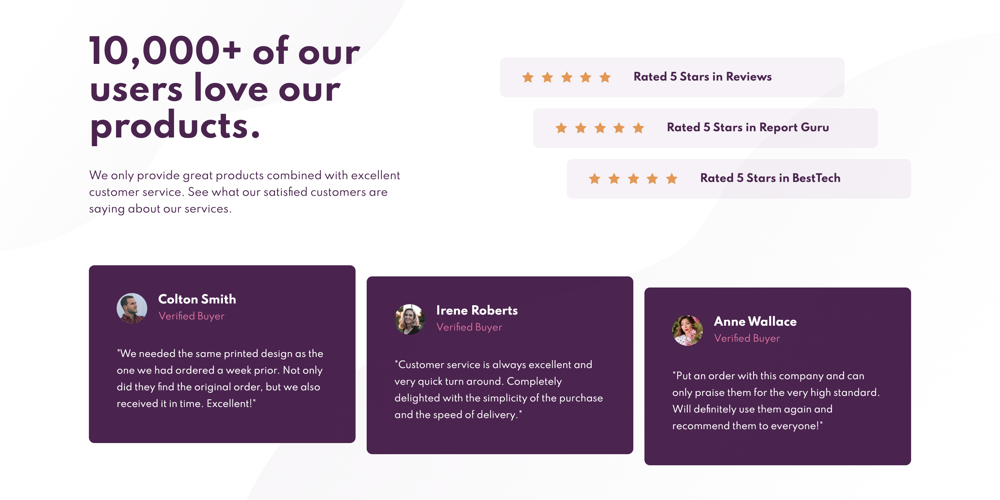

# Frontend Mentor - Social proof section solution

This is a solution to the [Social proof section challenge on Frontend Mentor](https://www.frontendmentor.io/challenges/social-proof-section-6e0qTv_bA). Frontend Mentor challenges help you improve your coding skills by building realistic projects.

## Table of contents

- [Overview](#overview)
  - [The challenge](#the-challenge)
  - [Screenshot](#screenshot)
  - [Links](#links)
- [My process](#my-process)
  - [Built with](#built-with)
  - [What I learned](#what-i-learned)
- [Author](#author)
- [Acknowledgments](#acknowledgments)

## Overview

### The challenge

Users should be able to:

- View the optimal layout for the section depending on their device's screen size

### Screenshot

### Links

- Solution URL: [https://www.frontendmentor.io/solutions/social-proof-solution-using-sass-cZ6V9znk9](https://www.frontendmentor.io/solutions/social-proof-solution-using-sass-cZ6V9znk9)
- Live Site URL: [https://dentednerd.github.io/fm-social-proof/](https://dentednerd.github.io/fm-social-proof/)

## My process

### Built with

- Semantic HTML5 markup
- CSS custom properties
- Flexbox
- CSS Grid
- Mobile-first workflow

### What I learned

This one was pretty straightforward. I guess that I've learned that positioning multiple background images relative to each other is a pain.

## Author

- Website - [Joey Imlay](https://joeyimlay.dev)
- Frontend Mentor - [@dentednerd](https://www.frontendmentor.io/profile/dentednerd)
- Twitter - [@dentednerd](https://www.twitter.com/dentednerd)
